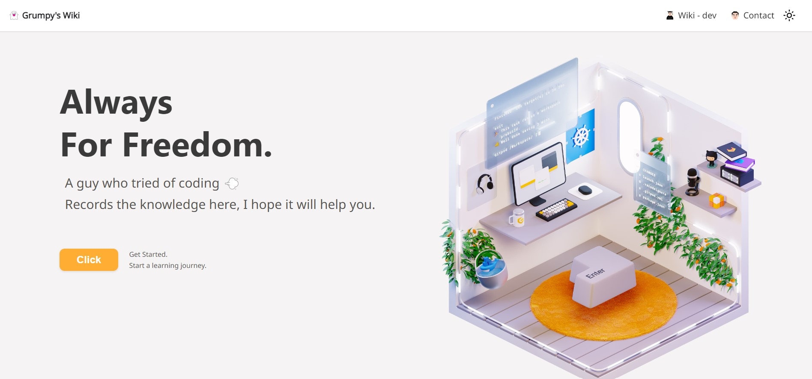

# Grumpy Wiki | [](https://app.netlify.com/sites/grumpy-wiki/deploys)

> Always For Freedom.
>
> A guy who tried of coding 💨
>
> Records the knowledge here, I hope it will help you.



## Table of contents

```markdown
Docuasurus
├─ docs
├─ wiki
│ ├─ dev
└─ contact
```

## Protocol

-   All **original** content on this site adopts the [GPL-3.0](http://www.thebigfly.com/gnu/FDLv1.3/) agreement.

-   All **cited third-party** original content on this site belongs to the original author\*\*. If there is any offense.

-   **Docusaurus** is [MIT licensed.](https://github.com/facebook/docusaurus/blob/main/LICENSE)

## Thanks

Feel the official maintenance and development of Docusaurus!
