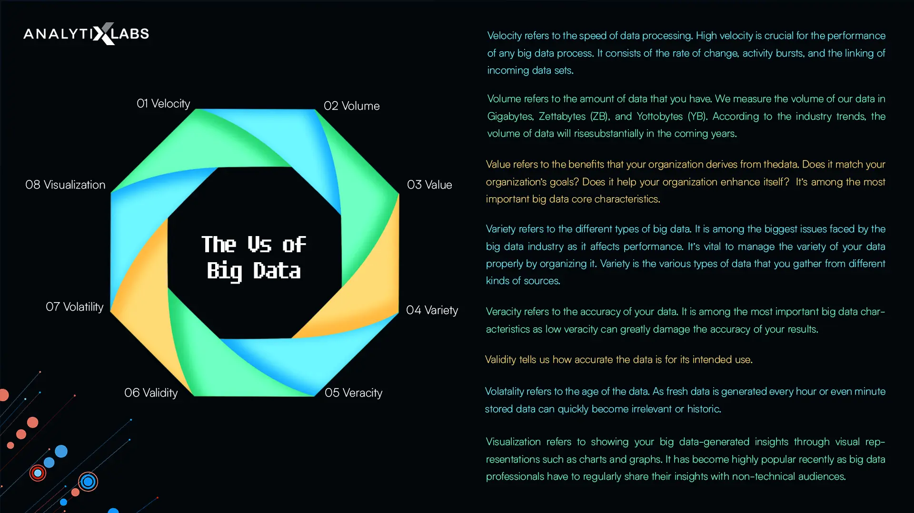

## Big Data

Big data is collection of data that is huge in volume, yet growing exponentially with time, It is a data with so large size and complexity that none of traditional data management tools can store it or process it efficiently. Big data is also a data but with huge size!

## Types Of Big Data

There are primarily three types of data in big data

### Structured

Structured data refers to the data that you can process, store, and retrieve in a fixed format. It is highly organized information that you can readily and seamlessly store and access from a database by using simple algorithms. This is the easiest type of data to manage as you know what data format you are working with in advance

### Unstructured

Data with an unknown structure is termed unstructured data. Its size is substantially bigger than structured data and is heterogeneous in nature

### Semi-Structured

As the name suggests, semi-structured data contains a combination of structured and unstructured data. It is data that hasn't been classified into a specific database but contains vital tags that separate individual elements within the same

## Characteristics Of Big Data

Following are the big data core characteristics. Understanding the characteristics of big data is vital to know how it works ajd how you can use it

