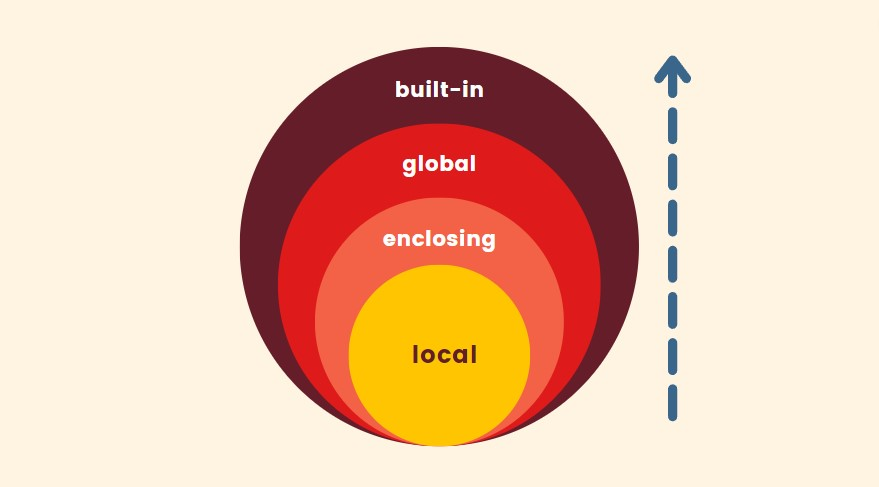

The basic Python data structures in Python include list, set, tuples, and dictionary. Each of the data structures is unique in its own way. Data structures are “containers” that organize and group data according to type.

## Strings

A **string** is a finite sequence of zero or more characters. In a Python program, if we enclose single or multiple characters with single or double quotes, we can represent a string

```py
# Quote string
s1 = 'hello, world!' # single-quote
s2 = "hello, world!" # double-quote

# Strings starting with three double or single quotes can be wrapped
s3 = """
hello,
world!
"""

#Use \ (backslash) in strings to indicate escape
s4 = '\n\t\141\u9a86\u660a'

# Use r at the beginning of the string to unescape
s5 = r'\n\\hello, world!\\\n'
#Output:\n\\hello, world!\\\n

print(s1, s2, s3, s4, s5 end='')
```

### String operations

-   Use the `+` operator to concatenate strings
-   Use the `*` operator to repeat the contents of a string
-   Use `in` and `not in` to determine whether a string contains another string (member operation)
-   Use `[]` and `[ : ]` operators to extract a character or characters from a string (slicing operation)

```py
# string * operation
s1 = 'hello ' * 3
# hello hello hello

# string addition
s2 = 'world'
s1 += s2 # hello hello hello world

# String in, not in operation
print('ll' in s1) # True
print('good' in s1) # False


str2 = 'abc123456'

# Extract the character at the specified position from the string (subscript operation)
print(str2[2]) # c

# String slice (from the specified start index to the specified end index)
print(str2[2:5]) # c12
print(str2[2:]) # c123456
print(str2[2::2]) # c246
print(str2[::2]) # ac246
print(str2[::-1]) # 654321cba
print(str2[-3:-1]) # 45
```

### Common string functions

```python
str1 = 'hello, world!'

# Calculate the length of the string using the built-in function len
only(str1) # 13

# get a capitalized copy of the first letter of the string
str1.capitalize() # Hello, world!

# Get a capitalized copy of each word in the string
str1.title() # Hello, World!

# Get the uppercase copy of the string
str1.upper() # HELLO, WORLD!

# Find the position of the substring in the string
str1.find('or') # 8
str1.find('shit') # -1

# Similar to find but throws an exception when the substring is not found
# print(str1.index('or'))
# print(str1.index('shit'))

# Check if the string starts with the specified string
str1.startswith('He') # False
str1.startswith('hel') # True

# Check if the string ends with the specified string
str1.endswith('!') # True

# Center the string with the specified width and pad the specified characters on both sides
str1.center(50, '*')

# Place the string on the right with the specified width and pad the specified characters on the left
str1.rjust(50, ' ')

str2 = 'abc123456'
# Check if the string consists of numbers
str2.isdigit()  # False

# Check if the string consists of letters
str2.isalpha()  # False

# Check if the string consists of numbers and letters
str2.isalnum()  # True

str3 = 'jackfrued@126.com'
# Get a copy of the string after trimming left and right spaces
str3.strip()
```

### String `f` formatted output

**Python 3.6** After, there is a more concise way to write format strings, which is to add the letter `f` before the string, we can use the following syntactic sugar to simplify the above code.

```py
a, b = 5, 10
print(f'{a} * {b} = {a * b}')
```

## LEGB

-   L : Lexical
-   E : Enclosing
-   G : Global
-   B : Built-In



### Global Scope

Variables declared outside of functions are in the global scope. All functions have access to them.

```py
movie = "Amadeus"
def review():
  print(movie)
  def inner():
    print(movie)
```

### Local Scope

Variables defined in a function are **scope to that function**. They are not available outside that function!

```py
def cube(num):
  answer = num ** 3
  print(answer)
```

### Enclosing Scope

Nested "inner" functions have access to variables declared in outer parent functions

```py
def outside():
  a = 10
  def inside():
    print("a is: ", a)
  inside()
```

### Built-In Scope

All the built-in objects in Python are in the Built-In Scope. We have access to them anywhere!

```py
str("5")
```

## Lists

List are **ordered collections** of data. <br/>
They can be hold any of the data types we've seen

### Creating Lists

```py
tasks = ['Trash', 'Dishes', 'Laundry', 'Dinner']
```

#### `list[index]`

We can retrieve individual elements from a list by passing an index number inside of square brackets. Like strings, indices start at 0

```py
langs = ["Python", "C", "Javascript"]
langs[1] # C
langs[0] # Python
```

### Updating Lists

Updating a specific element using its index

```py
nums = [7, 3, 9]
nums[1] = 8
nums # 7, 8, 9
```

#### `append`

Adds a single value to the end of a list

```py
nums = [1, 2, 3, 4]
nums.append(5)
nums # 1, 2, 3, 4, 5
```

#### `extend`

Accepts an iterable and appends each item from that iterable to the end of the list

```py
nums = [1, 2, 3]
nums.extend("abc")
nums # 1, 2, 3, a, b, c
```

#### `insert`

Insert "hi" before the element currently located at index 1

**insert(<a style={{color: 'red'}}>index</a>, <a style={{color: 'yellow'}}>element</a>)**

-   **<a style={{color: 'red'}}>index</a>** : Index before which to insert the element
-   **<a style={{color: 'yellow'}}>element</a>** : Element to be inserted into the list

```py
nums = [7, 8, 9]
nums.insert(1, "hi")
nums # 7, "hi", 8, 9
```

#### `slice`

**list[<a style={{color: 'red'}}>start</a> : <a style={{color: 'orange'}}>stop</a> : <a style={{color: 'yellow'}}>step</a>]**

```py
nums = [1, 2, 3, 4, 5, 6, 7, 8, 9]
nums[0:5:1] # [1, 2, 3, 4, 5]
nums[::2] # [1, 3, 5, 7, 9]
```

### Deletion Method

#### `clear`

The clear() method removes all items from a list

```py
nums = [7, 8, 9]
nums.clear()
nums  # []
```

#### `remove`

The remove(x) method will remove the **FIRST** element in the list that has a value of x

```py
langs = ['Python', 'C', 'JavaScript', 'C']
langs.remove('C')
langs # 'Python', 'JavaScript', 'C'
```

#### `pop`

The pop() method removes **AND** returns the last element from a list

```py
langs = ['Python', 'C', 'JavaScript', 'C']
langs.pop() # C
langs # 'Python', 'C', 'JavaScript'
```

#### `del`

The del statement (it's not a method!) can be used to delete an item from a specific index in a list

```py
langs = ['Python', 'C', 'JavaScript', 'C']
del langs[2]
langs # Python, C, C
```
